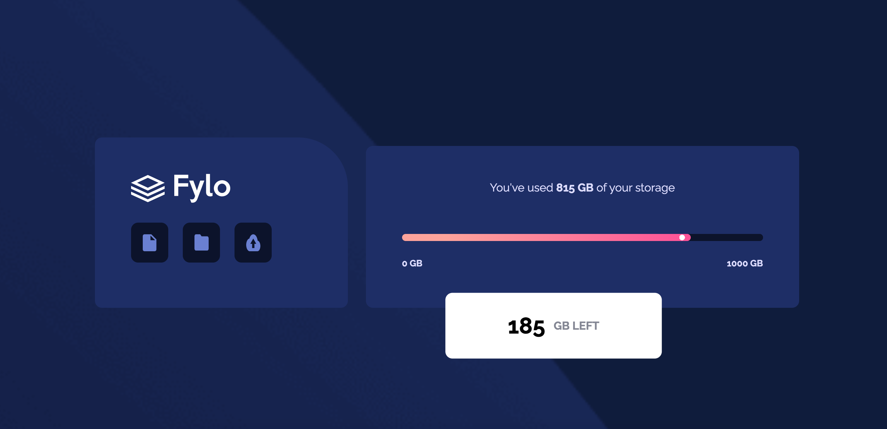

# Fylo

Fylo is a data storage component that displays the information about the status of used and remaining storage space. This is a challenge project from Frontend Mentor so I can test my HTML and CSS abilities.

## Technologies used :hammer_and_wrench:
- [HTML5](https://html.com)
- [CSS3](https://www.w3.org/Style/CSS/Overview.en.html)

## Requirements :computer:

To work with the code, you will need, before you begin, to install in your machine Git. Also, it's a good idea to have a source-code editor like [VSCode](https://code.visualstudio.com/).

## Main Learnings :nerd_face:
> Mobile-first (media query) 
> Styling tag progress (progress bar)

----

#### Check it out:  fylo-storage-project.netlify.app
#### Project based on challenge from [Frontend Mentor](https://www.frontendmentor.io/challenges/fylo-data-storage-component-1dZPRbV5n).

⌨️ with ❤️ by [Caroline Almeida Nikolic](https://github.com/CarolANikolic) 😊
